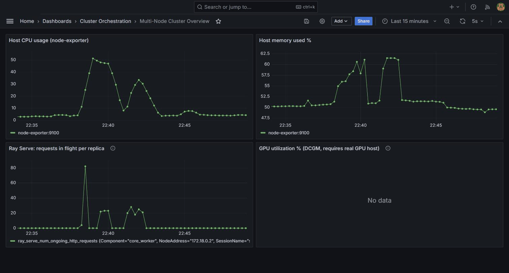
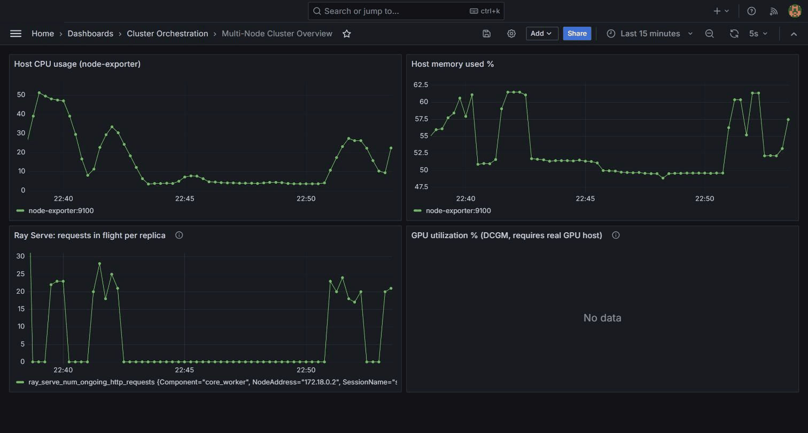
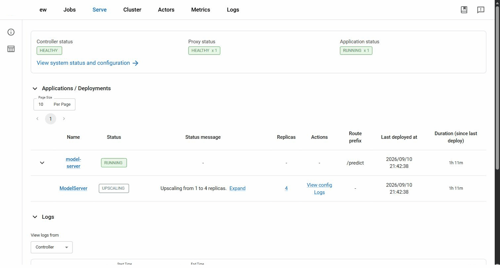
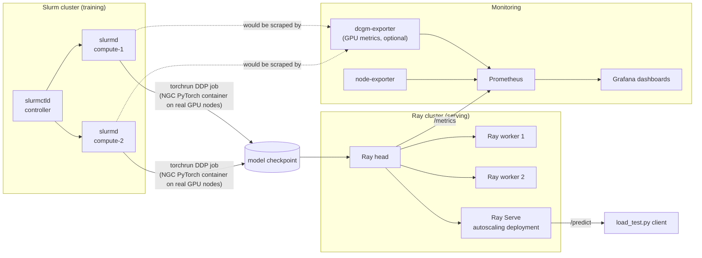

# Multi-Node Cluster Orchestration: Slurm Training → Ray Serve Deployment → Prometheus/Grafana Monitoring

A self-contained, runnable demonstration of the ML infrastructure lifecycle: **distributed multi-node training on a Slurm cluster** (with hooks for NVIDIA NGC containers), **scaled model deployment via Ray Serve**, and **performance monitoring/analysis via Prometheus + Grafana + DCGM**.

Everything runs locally with Docker Compose - no cloud account, no GPUs, and no cost required to stand it up and poke around. Every place a real GPU cluster would differ is called out explicitly and left as a documented, uncommented-and-ready config change (see [docs/architecture.md](docs/architecture.md)).

## Why this repo exists

This project is a direct, hands-on answer to a job requirement of this shape:

> "Hands-on experience with production-grade model deployment, performance monitoring and analysis, and scaling using Kubernetes, Ray, or Slurm to manage multi-node cluster configurations."

| JD requirement | Where it's demonstrated |
|---|---|
| Multi-node cluster configuration | [`slurm-cluster/`](slurm-cluster) - a real `slurm.conf`/`gres.conf` multi-node cluster (1 controller + 2 compute nodes), not a single-node toy |
| Scaling via Slurm | [`slurm-cluster/jobs/submit_distributed_training.sbatch`](slurm-cluster/jobs/submit_distributed_training.sbatch) - `torchrun`/DDP job spanning both compute nodes, with a ready-to-uncomment path to run the identical job inside an **NVIDIA NGC** container via Pyxis/Enroot on real GPU nodes |
| Scaling via Ray | [`ray-cluster/`](ray-cluster) - multi-node Ray cluster (head + 2 workers) serving a model through **Ray Serve** with an autoscaling replica config |
| Production-grade model deployment | [`ray-cluster/serve_app.py`](ray-cluster/serve_app.py) - a versioned, autoscaled `/predict` endpoint with a load-test client |
| Performance monitoring & analysis | [`monitoring/`](monitoring) - Prometheus scraping Ray + node + (optional) **DCGM** GPU metrics, visualized in provisioned Grafana dashboards |
| Kubernetes (mentioned as an alternative in the JD) | [docs/architecture.md](docs/architecture.md#moving-to-kubernetes) explains the equivalent KubeRay / Kubernetes path from this same design |

## Seeing it under load

Before a load test (this run already shows an earlier test's history, but the right edge is quiet):



During a fresh load test — host CPU, memory, and the "Ray Serve requests in flight" panel all rise together:



That request pressure is exactly what triggers Ray Serve's autoscaler, visible on the Ray dashboard at the same moment:



## Architecture



The Slurm training cluster is intentionally isolated on its own Docker network - mirroring how an on-prem HPC training partition is often network-segmented from the serving/inference environment in production. The Ray cluster and the monitoring stack share a network so Prometheus can scrape live metrics.

## Repo layout

```
multi-node-cluster-orchestration/
├── slurm-cluster/     # multi-node Slurm cluster: controller + 2 compute nodes, DDP training job
├── ray-cluster/       # multi-node Ray cluster: head + 2 workers, Ray Serve autoscaling deployment
├── monitoring/        # Prometheus + Grafana (+ optional DCGM) observability stack
├── scripts/           # up/down convenience scripts (bash + PowerShell)
├── docs/              # deeper architecture notes, GPU/NGC/Kubernetes migration path
└── .github/workflows/ # CI: validates every compose file, Slurm config, and Python script
```

## Quickstart

Requires Docker Desktop (or Docker Engine + Compose plugin) locally.

**Windows (PowerShell):**
```powershell
./scripts/up.ps1
```

**macOS/Linux:**
```bash
./scripts/up.sh
```

This brings up, in order: the shared Docker network, the monitoring stack, the Slurm cluster, and the Ray cluster.

Then:
- **Grafana** → http://localhost:3000 (`admin` / `admin`)
- **Prometheus** → http://localhost:9090
- **Ray dashboard** → http://localhost:8265

Submit the distributed training job across both Slurm compute nodes:
```bash
docker compose -f slurm-cluster/docker-compose.yml exec slurmctld \
  sbatch /home/demo/jobs/submit_distributed_training.sbatch
docker compose -f slurm-cluster/docker-compose.yml exec slurmctld squeue
```

Deploy and load-test the Ray Serve model:
```bash
docker compose -f ray-cluster/docker-compose.yml exec ray-head \
  pip install -r /home/ray/app/requirements.txt
docker compose -f ray-cluster/docker-compose.yml exec -d ray-head \
  python /home/ray/app/serve_app.py
docker compose -f ray-cluster/docker-compose.yml exec ray-head \
  python /home/ray/app/load_test.py
```

Tear everything down:
```bash
./scripts/down.sh   # or ./scripts/down.ps1
```

See each subdirectory's README for details, and [docs/architecture.md](docs/architecture.md) for the path from this local simulation to a real multi-node GPU cluster (NGC containers, Pyxis/Enroot, DCGM, and a Kubernetes/KubeRay equivalent).

## License

[MIT](LICENSE)

---

Built by Abdullah Abdelwahab as a demonstration of production-grade model deployment, performance monitoring, and multi-node cluster orchestration with Slurm and Ray.
